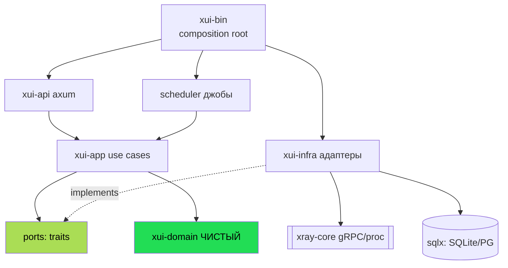

# 06 — Проектирование 3x-ui на Rust

Целевая архитектура — **гексагональная (порты и адаптеры) поверх DDD-модели** из [04](3x-ui/04-domain-model.md).
Принцип: **домен в центре, синхронный и чистый; вся async-инфраструктура — снаружи, в адаптерах.**

## 6.1. Принципы

1. **Dependency Rule.** Зависимости направлены только внутрь: `adapters → application → domain`.
   Домен не знает ни про БД, ни про HTTP, ни про gRPC, ни про `tokio`.
2. **Домен синхронный.** Никакого `async` в доменных типах. Это делает их тривиально тестируемыми и
   переиспользуемыми. I/O — за trait-портами, которые реализуют async-адаптеры.
3. **Xray-core за Anti-Corruption Layer.** Формат JSON и gRPC Xray не протекают глубже адаптера BC-2.
4. **Типы вместо проверок.** `Protocol`, `Credentials`, `TrustMode`, `Quota` — `enum`/newtype с
   валидацией в `TryFrom`. Невозможные состояния невыразимы.
5. **Ошибки — значения.** `thiserror` в библиотеках, `anyhow` на границах. Доменные ошибки — отдельный
   `enum`, не строки.

## 6.2. Технологический стек

| Слой | Выбор | Почему |
|------|-------|--------|
| Async runtime | **`tokio`** | Де-факто стандарт, нужен для gRPC/HTTP/процессов |
| HTTP / API | **`axum`** | Tower-экосистема, middleware, типобезопасные extractors |
| gRPC к Xray-core | **`tonic`** | Тот же протокол, что Xray gRPC API (Handler/Stats/Routing) |
| ORM / БД | **`sqlx`** (compile-time проверка SQL) | SQLite + Postgres, без «магии» ORM; запросы видны |
| Миграции | **`sqlx::migrate!`** | Версионируемые, как сидеры в Go |
| Сериализация | **`serde` / `serde_json`** | Конфиг Xray, подписки, API |
| Валидация | **`garde`** или ручные `TryFrom` | Доменные инварианты на входе |
| Шина событий | **`tokio::sync::broadcast`** | Эквивалент `eventbus` |
| Планировщик | **`tokio-cron-scheduler`** | Эквивалент robfig/cron |
| Telegram | **`teloxide`** | Зрелый bot-фреймворк |
| OpenAPI | **`utoipa`** + `utoipa-swagger-ui` | Контракт из кода → TS-типы для фронта (как Go-openapigen) |
| Логирование | **`tracing`** + `tracing-subscriber` | Структурные логи, спаны, ring-buffer для UI |
| Property-тесты | **`proptest`** | Эквивалент `pgregory.net/rapid` |
| Процессы | `tokio::process` | Управление дочерним `xray` |
| QR / ссылки | `qrcode` / ручной билдер | Share-links |

Фронтенд можно **оставить как есть** (React 19 + Ant Design) — он общается по HTTP/WS, бэкенду
безразличен язык. Это снижает объём миграции.

## 6.3. Структура workspace (cargo)

Контексты из [03](3x-ui/03-bounded-contexts.md) → crate'ы. Домен и приложение отделены от адаптеров.

```
xui/                         # cargo workspace
├── crates/
│   ├── xui-domain/          # ── ЯДРО. Чистое, sync, без I/O, без tokio ──
│   │   ├── access/          #   BC-1: Inbound, Client, инварианты, политики
│   │   ├── xray/            #   BC-2: XrayConfig, HotDiffCalculator, ApplyPlan, ConfigBuilder
│   │   ├── subscription/    #   BC-3: ShareLinkGenerator, Clash/Json renderers, FallbackProjection
│   │   ├── traffic/         #   BC-4: Traffic, QuotaPolicy, Aggregator
│   │   ├── federation/      #   BC-5: Node, OnlineTreeMerger, sync-планы
│   │   ├── settings/        #   BC-7: Settings (VO-агрегат)
│   │   └── events/          #   Published Language: DomainEvent
│   │
│   ├── xui-app/             # ── Слой приложения: use cases + порты (traits) ──
│   │   ├── ports/           #   trait'ы: репозитории, XrayController, NodeClient, Notifier, Clock
│   │   └── usecases/        #   CreateClient, ApplyConfig, CollectTraffic, GenerateSub, SyncNode...
│   │
│   ├── xui-infra/           # ── Адаптеры (async, tokio) ──
│   │   ├── persistence/     #   sqlx-репозитории (SQLite/Postgres)
│   │   ├── xray/            #   ACL: tonic-клиент Xray gRPC + tokio::process + config.json writer
│   │   ├── federation/      #   reqwest/tonic + mTLS к нодам
│   │   ├── notify/          #   teloxide + SMTP
│   │   └── scheduler/       #   tokio-cron-scheduler джобы
│   │
│   ├── xui-api/             # ── axum: REST + WebSocket + сессии/CSRF/2FA + OpenAPI ──
│   │
│   └── xui-bin/             # ── main: composition root, CLI, bootstrap, сигналы ──
│
├── migrations/              # sqlx миграции
└── frontend/                # (переиспользуем React-SPA из Go-версии)
```

> Правило: **`xui-domain` не имеет в `Cargo.toml` ни `tokio`, ни `sqlx`, ни `tonic`.** Если потянуло
> их добавить — значит, логика просочилась не туда.

## 6.4. Поток зависимостей



Стрелки `-.implements.->` — единственное место, где инфраструктура «подключается» к ядру: через
реализацию trait-портов. Домен о существовании `xui-infra` не знает.

## 6.5. Ключевые порты (traits в `xui-app/ports`)

```rust
// Персистентность — по агрегату на репозиторий (см. 04.9).
#[async_trait] pub trait InboundRepository { /* get, list, save, delete */ }
#[async_trait] pub trait ClientRepository  { /* get_by_email, list_paged, save, bulk_* */ }
#[async_trait] pub trait NodeRepository    { /* ... */ }
#[async_trait] pub trait TrafficStore      { /* add, reset, history */ }

// Anti-Corruption Layer вокруг Xray-core. Домен отдаёт ApplyPlan — адаптер исполняет.
#[async_trait]
pub trait XrayController {
    async fn apply(&self, plan: ApplyPlan) -> Result<()>;     // hot-ops или рестарт
    async fn restart(&self, config: XrayConfig) -> Result<()>;
    async fn query_traffic(&self) -> Result<Vec<TrafficSample>>;
    async fn online_users(&self) -> Result<Vec<OnlineUser>>;
    fn state(&self) -> XrayState;
}

// Federation: общение с удалённой нодой (mTLS).
#[async_trait] pub trait NodeClient { /* heartbeat, push_clients, pull_traffic */ }

// Уведомления (Telegram/SMTP) — за портом.
#[async_trait] pub trait Notifier { async fn notify(&self, e: &DomainEvent) -> Result<()>; }

// Время — порт ради тестируемости политик (срок/grace).
pub trait Clock { fn now_ms(&self) -> i64; }
```

## 6.6. Пример use case (слой приложения)

Сценарий U6 «горячо переприменить конфиг» — показывает, как чистый домен и async-адаптеры соединяются:

```rust
pub struct ApplyConfig<'a> {
    pub inbounds: &'a dyn InboundRepository,
    pub xray:     &'a dyn XrayController,
    pub clock:    &'a dyn Clock,
}

impl ApplyConfig<'_> {
    pub async fn execute(&self) -> Result<ApplyOutcome> {
        // 1. async: собрать состояние
        let inbounds = self.inbounds.list_all().await?;

        // 2. ЧИСТЫЙ домен: построить новый конфиг и вычислить план
        let new_cfg  = XrayConfigBuilder::build(&inbounds);          // sync, тестируемо
        let current  = self.xray.current_config();                   // снимок
        let plan     = HotDiffCalculator::compute(&current, &new_cfg); // sync, ядро ценности

        // 3. async: исполнить план через ACL
        match plan {
            ApplyPlan::NoOp        => Ok(ApplyOutcome::Unchanged),
            ApplyPlan::Hot(ops)    => { self.xray.apply(ApplyPlan::Hot(ops)).await?;
                                        Ok(ApplyOutcome::HotApplied) }
            ApplyPlan::Restart     => { self.xray.restart(new_cfg).await?;
                                        Ok(ApplyOutcome::Restarted) }
        }
    }
}
```

Вся ценность (`HotDiffCalculator::compute`, `XrayConfigBuilder::build`) — синхронна и тестируется без
сети. Async — только оболочка ввода-вывода.

## 6.7. Модель конкурентности

- **HTTP/API**: `axum` поверх `tokio` — по задаче на запрос.
- **Сбор трафика**: фоновая задача `tokio::spawn`, тик ~5 с (как `cadenceXrayTraffic`), читает Xray,
  пишет в `TrafficStore`, прогоняет `QuotaPolicy`, при отключениях шлёт `DomainEvent`.
- **Состояние Xray-процесса**: одна владеющая задача-актор (`XrayProcess`) с командным каналом
  (`mpsc`) — сериализует start/stop/apply, исключая гонки. Это чище, чем мьютексы Go-версии.
- **WebSocket-хаб**: `tokio::sync::broadcast` для фан-аута + throttling (250 мс) на типах
  status/traffic/inbounds (точно как Go-хаб).
- **Event bus**: `broadcast`-канал + `RateLimiter` (гашение дребезга) поверх.

## 6.8. Персистентность

- `sqlx` с compile-time-проверкой запросов; одна и та же схема для SQLite (default, WAL) и Postgres.
- Миграции `sqlx::migrate!`; идемпотентные «сидеры» (как `HistoryOfSeeders`) — отдельной таблицей версий.
- Репозитории мапят строки БД ↔ доменные агрегаты (явный маппинг, без active-record-протекания).
- Маппинг агрегатов: `Inbound`, `Client` (+ `client_inbounds` join), `Node`, `Settings`,
  `ClientTraffic`, `NodeClientTraffic`, `ClientGlobalTraffic` — 1:1 с моделями Go ([04](3x-ui/04-domain-model.md)).

## 6.9. Тестовая стратегия

| Уровень | Инструмент | Что покрываем |
|---------|-----------|----------------|
| Unit (домен) | стандартные `#[test]` | инварианты Client/Inbound, QuotaPolicy |
| Property | **`proptest`** | hot-diff (семантическое равенство JSON), агрегация трафика, генерация ссылок — как `rapid` в Go |
| Контракт портов | мок-реализации trait'ов | use cases без реального I/O |
| Интеграция | `sqlx::test` + тестовый Xray | репозитории, ACL Xray |

> Доменное ядро тестируется **без `tokio`, БД и сети** — это и есть главный дивиденд гексагональной
> архитектуры и причина делать домен синхронным.

## 6.10. План миграции (прагматичный, инкрементальный)

Не «переписать всё за раз», а вертикальными срезами:

1. **Этап 0 — каркас.** Workspace, `xui-domain` с `Protocol/Traffic/Quota/Client/Inbound` + unit-тесты.
2. **Этап 1 — ACL Xray.** `tonic`-клиент + `tokio::process` + `HotDiffCalculator`. Доказать, что
   можем поднять Xray, завести юзера, снять трафик. Это самый рискованный кусок — делаем первым.
3. **Этап 2 — Access + персистентность.** `axum` CRUD инбаундов/клиентов поверх `sqlx`. Лимиты-политики.
4. **Этап 3 — Subscription.** Генераторы ссылок/Clash/JSON + fallback-проекция (порт ценности для юзера).
5. **Этап 4 — Traffic + джобы.** Сбор, сброс по периодам, авто-отключение, метрики.
6. **Этап 5 — Federation, Notification, 2FA/LDAP.** Supporting-контексты.
7. Фронтенд переиспользуется; на каждом этапе обновляется OpenAPI-контракт.

> Существующая Go-панель остаётся эталоном поведения: на этапах 2–4 прогоняем те же сценарии и
> сверяем выход (ссылки, конфиги Xray, цифры трафика) байт-в-байт там, где это возможно.
