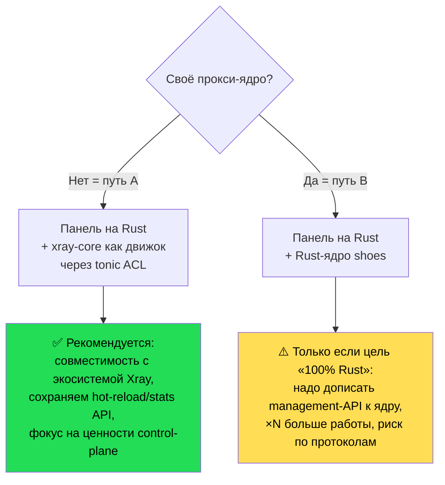

# 07 — Обзор Rust-экосистемы по теме

Прежде чем писать своё, смотрим, что уже есть. Вывод вперёд: **готовой замены 3x-ui на Rust нет**
(всё, что близко, — либо ранняя альфа, либо это прокси-**ядро**, а не панель). Зато есть отличные
строительные блоки.

## 7.1. Две принципиально разные категории

При проектировании 3x-ui на Rust есть развилка:

- **(A) Панель-оркестратор поверх существующего ядра** (как сам 3x-ui: панель на Rust + `xray-core` на Go).
  → Меньше работы, совместимость со всей экосистемой Xray. **Рекомендуемый путь** (см. [06](06-rust-redesign.md)).
- **(B) Панель + собственное прокси-ядро на Rust** (заменить и Go-панель, и `xray-core`).
  → Огромный объём (протоколы vless/vmess/reality/...), но «всё на Rust». Реалистично только если
  взять готовое Rust-ядро как движок.

## 7.2. Прокси-ядра на Rust (кандидаты на data-plane, путь B)

| Проект | Что это | Зрелость | Применимость |
|--------|---------|----------|--------------|
| **[`cfal/shoes`](https://github.com/cfal/shoes)** | Высокопроизводительный мульти-протокольный прокси-**сервер** на Rust: VLESS, VMess AEAD, Trojan, Shadowsocks, Hysteria2, TUIC v5, Snell, NaiveProxy, AnyTLS + транспорты ShadowTLS/TLS/WS/**XTLS Reality**/**Vision** + TUN | ~1.1k★, активен, v0.2.7 (янв 2026) | **Лучший кандидат на Rust-ядро.** Покрывает ровно те протоколы, что нужны панели. Но: **только сервер, без management-API** — пришлось бы дописывать слой управления (config-reload, статистика per-user). |
| **[`leaf`](https://github.com/eycorsican/leaf)** | Лёгкая прокси-утилита (inbound/outbound), Trojan/VMess/WS и др. | средняя | Скорее клиентское/утилитарное ядро; меньше серверных протоколов, чем у shoes. |

> Ключевая проблема пути B: ядра вроде `shoes` **не дают того gRPC management API**, на котором стоит
> вся механика 3x-ui (add/remove user на горячую, per-user-статистика, online-users). Пришлось бы
> либо форкать ядро и встраивать API, либо терять hot-reload. Поэтому путь A проще и надёжнее.

## 7.3. Панели / control-plane на Rust

| Проект | Что это | Статус | Вывод |
|--------|---------|--------|-------|
| **`Necko1/necko-xray`** | CLI/TUI-обёртка-«control panel» над xray-core на Rust + Docker: switch-конфигов, добавление клиентов, TUI-дашборд, подписки, мульти-нода, Telegram-бот, per-IP лимиты, REST API | **Deep alpha** (репозиторий на момент проверки 2026-06-16 отдаёт 404 — возможно, переименован/скрыт) | По описанию — ближайший идейный аналог нашей цели (панель на Rust поверх xray-core). Но незрелый и нестабильно доступный → **не основа, а ориентир по фичам.** |
| Прочие «x-ui»-форки | `alireza0/x-ui`, `sing-web/x-ui`, `AghayeCoder/tx-ui` и т.п. | зрелые | **Все на Go**, не Rust. Полезны как референс поведения, не как код. |

## 7.4. Готовые строительные блоки (точно берём)

Эти crate'ы закрывают инфраструктуру панели (соответствуют выбору из [06](06-rust-redesign.md#62-технологический-стек)):

- **`tonic`** — gRPC-клиент к Xray-core (Handler/Stats/Routing services) — сердце ACL пути A.
- **`axum` + `tower`** — REST/WS вместо Gin.
- **`sqlx`** — SQLite/Postgres вместо GORM.
- **`teloxide`** — Telegram-бот вместо telego.
- **`tokio-cron-scheduler`** — джобы вместо robfig/cron.
- **`utoipa`** — OpenAPI-контракт вместо самописного `tools/openapigen`.
- **`proptest`** — property-тесты вместо `pgregory.net/rapid`.
- **`rustls` / `tokio-rustls`** — TLS и **mTLS** для federation вместо стандартного Go-TLS.

## 7.5. Итоговая рекомендация по стратегии

**Рекомендация:** идти **путём A**. 3x-ui — это панель управления, и её ценность — в control-plane
(лимиты, подписки, hot-diff, federation), а не в реализации прокси-протоколов. Xray-core (на Go) уже
безупречно делает data-plane и предоставляет gRPC API ровно под наши нужды. Переписываем на Rust
**панель**, а ядро оставляем как внешний движок за Anti-Corruption Layer.

К пути B (с `shoes` как движком) имеет смысл вернуться позже, отдельной инициативой, когда control-plane
на Rust стабилизируется и появится потребность убрать Go-зависимость целиком.

---
*Поиск выполнен 2026-06-16; статусы проектов могут меняться — перепроверяйте перед стартом.*

> **Повторная проверка 2026-06-16 (web).** Вывод не изменился: зрелой Rust-панели — замены 3x-ui — нет.
> Поиск возвращает сам Go-3x-ui и его форки (`hasanddn19/3x-ui`, `vR3za/SN3-XUI` и т.п. — все на Go) плюс
> расплывчатое упоминание некоего «Rust + React control panel» без подтверждаемого репозитория.
> Точка мониторинга Rust-проектов по теме: [GitHub topic `vless` (фильтр Rust)](https://github.com/topics/vless?l=rust&o=asc&s=forks)
> и [topic `xray-core`](https://github.com/topics/xray-core). Рекомендация — **путь A** — в силе.

## Источники

- [MHSanaei/3x-ui](https://github.com/MHSanaei/3x-ui)
- [cfal/shoes](https://github.com/cfal/shoes)
- [eycorsican/leaf](https://github.com/eycorsican/leaf)
- [XTLS/Xray-core](https://github.com/xtls/xray-core)
- `Necko1/necko-xray` (ссылка на момент проверки недоступна — 404)
