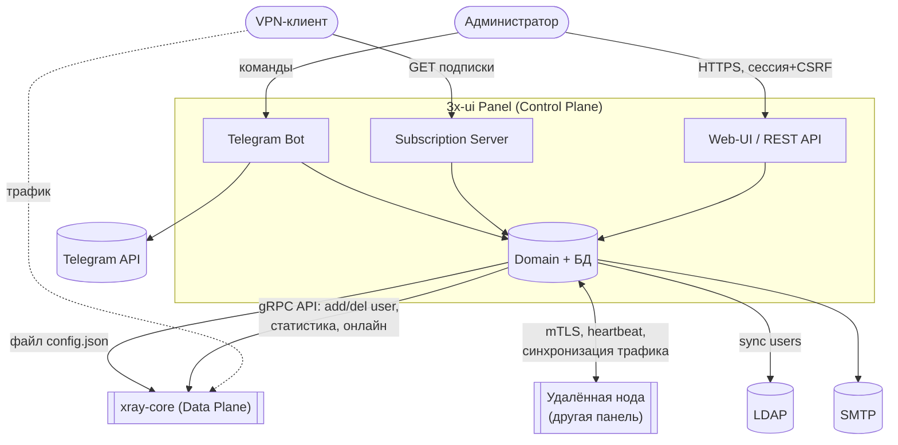

# 01 — Системный контекст и видение

## 1.1. Что делает система

3x-ui — **панель управления (control plane)**, а не дата-плейн. Сама она байты трафика
не проксирует. Её работа — превратить намерения администратора («заведи пользователя X с лимитом
50 ГБ до 1 августа на VLESS-инбаунде на порту 443») в:

1. корректный JSON-конфиг для процесса `xray-core`;
2. записи в собственной БД (для учёта, лимитов, истории);
3. ссылки-подписки, которые клиент импортирует в своё приложение.

И обратно: считать с работающего `xray` статистику трафика и онлайн-пользователей, применять к ним
бизнес-правила (лимиты, срок действия, лимит IP), уведомлять, и при необходимости отключать.

## 1.2. Акторы (кто пользуется системой)

| Актор | Роль | Через что взаимодействует |
|-------|------|---------------------------|
| **Администратор панели** | Заводит инбаунды, клиентов, настройки, ноды | Web-UI (React SPA), Telegram-бот |
| **Конечный клиент (VPN-юзер)** | Получает конфиг и потребляет трафик | Subscription-эндпоинт (HTTP), затем его прокси-приложение → Xray |
| **Xray-core (процесс)** | Дата-плейн: реально проксирует трафик | gRPC API + файл-конфиг + stdout/stderr |
| **Удалённая нода (другая панель)** | Federation: распределённые точки выхода | gRPC/HTTPS + mTLS, heartbeat |
| **LDAP-сервер** | Источник пользователей (опц.) | LDAP-запросы (синхронизация) |
| **SMTP / Telegram** | Каналы уведомлений | SMTP, Telegram Bot API |
| **Планировщик (cron)** | Внутренний актор: запускает фоновые задачи | Внутренние джобы |

## 1.3. Контекстная диаграмma (C4 Level 1)



**Та же диаграмма в ASCII (терминал-friendly):**

```
        ┌───────────────┐                         ┌───────────────────┐
        │ Администратор │                         │   VPN-клиент      │
        └──────┬────────┘                         └───┬────────────┬──┘
  Web-UI/REST  │  Telegram               GET подписки │            │ трафик
   (HTTPS,     ▼                                      ▼            │ (в обход
    сессия+CSRF)                                                   │  панели,
   ╔══════════════════════════════════════════════════════╗        │  напрямую
   ║  3x-ui PANEL — Control Plane                         ║◀───────┘  в Xray)
   ║  ┌──────────┐  ┌──────────────┐  ┌──────────────┐    ║        ╎
   ║  │ Web/REST │  │ Subscription │  │ Telegram Bot │    ║        ╎
   ║  └────┬─────┘  └──────┬───────┘  └──────┬───────┘    ║        ╎
   ║       └───────────────┼─────────────────┘            ║        ╎
   ║                  ┌────▼─────┐                        ║        ╎
   ║                  │  Domain  │── БД (SQLite/Postgres) ║        ╎
   ║                  └────┬─────┘                        ║        ╎
   ╚═══════════════════════┼══════════════════════════════╝        ╎
        gRPC API +         │         mTLS,        sync/notify      ╎
        config.json        │       heartbeat                       ╎
     ┌─────────────────────┼──────────────┬──────────────────┐     ╎
     ▼                     ▼              ▼                  ▼     ╎
┌──────────┐          ┌──────────┐   ┌──────────┐      ┌──────────┐╎
│ xray-core│◀╌ трафик╌│ Удалённая│   │  LDAP /  │      │ xray-core│╯
│DataPlane │  клиента │   нода   │   │SMTP / TG │      │ на ноде  │
└──────────┘          └──────────┘   └──────────┘      └──────────┘
   ╎────────────────── поток трафика клиента (╌╌) идёт МИМО панели ──────────────╯
```

## 1.4. Ключевые сценарии (use cases верхнего уровня)

- **U1. Завести клиента** на одном/нескольких инбаундах → сгенерировать конфиг → горячо применить к Xray.
- **U2. Отдать подписку** клиенту (raw-ссылки / Clash YAML / Xray JSON) с учётом нод и fallback'ов.
- **U3. Считать трафик** с Xray каждые ~5 с и накопить в БД (per-inbound и per-client).
- **U4. Применить лимиты**: при превышении объёма / истечении срока / превышении числа IP — отключить клиента.
- **U5. Сбросить трафик** периодически (hourly/daily/weekly/monthly) согласно настройке инбаунда.
- **U6. Горячо переприменить конфиг** Xray, перезапуская процесс только если изменились «статические» секции.
- **U7. Federation**: синхронизировать клиентов и трафик с удалёнными нодами, агрегировать онлайн.
- **U8. Уведомить** админа (Telegram/SMTP) о событиях: падение Xray, нода офлайн, высокий CPU, попытка входа.

## 1.5. Видение проекта на Rust

**Цель:** спроектировать 3x-ui заново на Rust — не как механический порт Go-кода, а как
чистую DDD-систему, где:

- **Домен** (правила лимитов, hot-diff, генерация ссылок) — синхронный, без зависимостей от БД/сети,
  покрыт property-тестами (в Go это уже делается через `pgregory.net/rapid` — заимствуем подход).
- **Xray-core остаётся внешним движком** за Anti-Corruption Layer. Переписывать дата-плейн —
  отдельный многолетний проект (см. [07](../07-rust-ecosystem-survey.md)); панель этого не требует.
- **Async-инфраструктура** (HTTP, gRPC к Xray, БД, процессы, Telegram) изолирована в адаптерах
  на `tokio`.
- **Безопасность типов** заменяет целый класс рантайм-проверок Go: протоколы, стратегии адресации,
  режимы доверия нод, единицы трафика — это `enum`'ы и newtype'ы, а не строки.

**Не-цели:** написание собственного прокси-протокола; поддержка любого экзотического транспорта
сразу; 100% UI-паритет с Go-версией в первой итерации.

См. конкретный технологический стек и структуру crate'ов в [06-rust-redesign.md](../06-rust-redesign.md).
