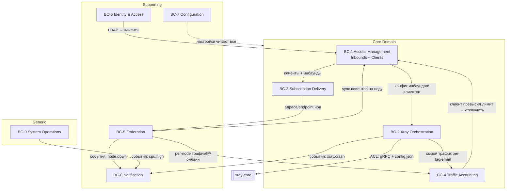

# 03 — Ограниченные контексты и карта контекстов

В Go-версии всё лежит в одном модуле `internal/` без явных границ. Применяя DDD, мы **разрезаем
систему по швам предметной области**. Каждый контекст — это автономная модель со своим языком,
своими инвариантами и (в идеале) своей схемой данных.

## 3.1. Список ограниченных контекстов

| # | Контекст | Ядро ответственности | Тип (DDD) |
|---|----------|----------------------|-----------|
| **BC-1** | **Access Management** (Инбаунды и Клиенты) | Конфигурация инбаундов, жизненный цикл клиентов, лимиты (объём/срок/IP) | **Core Domain** |
| **BC-2** | **Xray Orchestration** | Управление процессом Xray, генерация конфига, hot-diff, gRPC-API, сбор трафика | **Core Domain** |
| **BC-3** | **Subscription Delivery** | Генерация ссылок/Clash/JSON, fallback-проекция, внешние ссылки | **Core Domain** |
| **BC-4** | **Traffic Accounting** | Накопление и сброс трафика, применение квот, история метрик | **Core Domain** |
| **BC-5** | **Federation** (Ноды) | Реестр нод, heartbeat, синхронизация клиентов/трафика, агрегация онлайна | Supporting |
| **BC-6** | **Identity & Access** | Аутентификация админа, сессии, 2FA, API-токены, LDAP-синхронизация | Supporting |
| **BC-7** | **Configuration** | Глобальные настройки панели, mTLS-материал, валидация | Supporting |
| **BC-8** | **Notification** | Telegram-бот, SMTP, event bus, rate-limiting уведомлений | Supporting |
| **BC-9** | **System Operations** | Статус хоста (CPU/mem/disk), бэкап/restore БД, апдейт панели, логи | Generic |

> **Core Domain** — то, ради чего система существует и где сосредоточена конкурентная ценность.
> **Supporting** — нужно, но не уникально. **Generic** — можно взять готовое.

## 3.2. Карта контекстов (Context Map)



**Та же карта в ASCII:**

```
  ╔═══════════════════ CORE DOMAIN ════════════════════╗
  ║                                                    ║
  ║   ┌────────────────────┐   конфиг    ┌───────────┐ ║   ACL: gRPC +
  ║   │ BC-1 Access Mgmt   │────────────▶│ BC-2 Xray │ ║   config.json   ┌──────────┐
  ║   │ Inbounds + Clients │◀──┐         │ Orchestr. │─╫────────────────▶│ xray-core│
  ║   └─────┬────────┬─────┘   │         └─────┬─────┘ ║                 └──────────┘
  ║         │        │         │ «лимит        │       ║
  ║ клиенты+│        │ Shared  │  превышен     │ сырой трафик
  ║ инбаунды│        │ Kernel  │  → откл.»     │ per-tag/email
  ║         ▼        │         │               ▼       ║
  ║   ┌──────────┐   │   ┌─────┴──────┐  ┌────────────┐║
  ║   │BC-3 Sub- │   └──▶│            │  │ BC-4       │║
  ║   │scription │       │            │  │ Traffic    │║
  ║   └────┬─────┘       └────────────┘  │ Accounting │║
  ║        │ адреса/endpoint нод         └─────▲──────┘║
  ╚════════╪══════════════════════════════════╪════════╝
           ▼                                   │ per-node трафик/IP/онлайн
  ╔════ SUPPORTING ════╗  ┌─────────────┐      │
  ║ ┌────────────────┐ ║  │ BC-6        │ LDAP │
  ║ │ BC-5 Federation│─╫──┤ Identity    │─────▶│ (Conformist)
  ║ │  (Ноды)        │◀╫─▶│ & Access    │      │
  ║ └───────┬────────┘ ║  └─────────────┘      │
  ║ ┌───────┴────────┐ ║  ┌─────────────┐      │
  ║ │ BC-7 Config    │─╫─▶│ читают все  │      │
  ║ │ (Shared Kernel)│ ║  └─────────────┘      │
  ║ └────────────────┘ ║                       │
  ║ ┌────────────────┐ ║   события (Published Language)
  ║ │ BC-8 Notify    │◀╫───── xray.crash / node.down / cpu.high ──── от всех
  ║ └────────────────┘ ║
  ╚════════════════════╝   ╔ GENERIC. ═══╗
                           ║ BC-9 SysOps ║
                           ╚═════════════╝
```

## 3.3. Отношения между контекстами (DDD-паттерны интеграции)

| Связь | Паттерн интеграции | Комментарий |
|-------|---------------------|-------------|
| BC-2 → xray-core | **Anti-Corruption Layer** | Самая важная граница. JSON-формат и gRPC Xray не должны протекать в домен. Всё переводится в наши термины. |
| BC-4 → BC-1 | **Domain Events / Customer-Supplier** | «Трафик превышен» — событие, на которое реагирует Access Management, отключая клиента. Слабая связь. |
| BC-1 → BC-2 | **Customer-Supplier** | Access Management — заказчик: формирует намерение, Orchestration исполняет (генерит конфиг + применяет). |
| BC-1 → BC-3 | **Shared Kernel** (Client, Inbound) | Подписки читают те же агрегаты Client/Inbound. Общее ядро моделей. |
| BC-5 ↔ BC-1/BC-4 | **Partnership** | Federation тесно сотрудничает: синхронизирует клиентов и сводит трафик. Двусторонний контракт (mTLS gRPC). |
| BC-6 → BC-1 | **Conformist** (LDAP) | LDAP — внешний апстрим; мы подстраиваемся под его модель пользователей. |
| BC-8 ← все | **Published Language** (Domain Events) | Все контексты публикуют события в общий «опубликованный язык» событий; Notification — подписчик. |
| BC-7 → все | **Shared Kernel** (read-only) | Настройки читаются повсеместно; в Go это `SettingService` без DI — на Rust лучше передавать снимок настроек явно. |

## 3.4. Соответствие Go-пакетам (трассируемость)

Чтобы было видно, откуда что взято в исходнике:

| Контекст | Go-пакеты-источники |
|----------|---------------------|
| BC-1 Access | `web/service/client*.go`, `web/service/inbound*.go`, `web/controller/{client,inbound}.go`, `database/model` (Inbound, ClientRecord, ClientInbound) |
| BC-2 Xray | `internal/xray/*` (process, config, api, hot_diff, inbound, traffic), `web/service/xray*.go`, `web/runtime` |
| BC-3 Subscription | `internal/sub/*` (service, clash_service, json_service, links, external_subscription) |
| BC-4 Traffic | `web/service/{client_traffic,inbound_traffic,traffic_writer,metric_history}.go`, `internal/xray/{traffic,client_traffic}.go`, `web/job` (reset/sync jobs) |
| BC-5 Federation | `web/service/node*.go`, `web/controller/node.go`, `database/model` (Node, NodeClientTraffic, NodeClientIp, ClientGlobalTraffic) |
| BC-6 Identity | `web/session`, `web/middleware` (CSRF/auth), `util/ldap`, `web/service/setting*.go` (2FA), `web/controller/{login_limiter,api}.go` |
| BC-7 Config | `internal/config`, `web/service/setting*.go`, `web/entity` (AllSetting), `setting_mtls.go` |
| BC-8 Notification | `internal/eventbus`, `web/service/tgbot`, `web/service/email`, `web/service/integration` |
| BC-9 System Ops | `web/service/server.go`, `util/sys`, `internal/logger` |

> **Вывод для Rust:** эти 9 контекстов превращаются в workspace-crate'ы (или модули). Core-контексты
> (BC-1..4) получают самую тщательную доменную модель; Generic (BC-9) можно реализовать тонко.
> Детали — в [06-rust-redesign.md](../06-rust-redesign.md).
