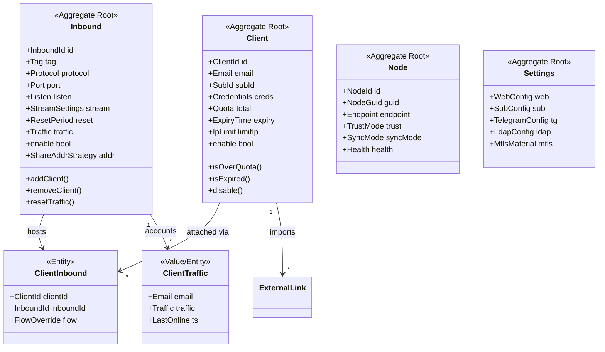

# 04 — Доменная модель: агрегаты, сущности, value objects, инварианты

Это смысловое ядро документа. Здесь домен 3x-ui выражен в строгих терминах тактического DDD.
Каждый агрегат — это граница согласованности (consistency boundary): внутри неё инварианты держатся
всегда, изменения проходят через корень агрегата.

## 4.1. Обзор агрегатов



> **Важное наблюдение по моделированию.** В Go `Client` (модель `ClientRecord`) и его привязка к
> инбаундам (`ClientInbound`) разделены — это позволяет одному клиенту жить на многих инбаундах.
> Это **правильное DDD-решение**: `Client` — самостоятельный агрегат, а не часть `Inbound`. На Rust
> сохраняем: `Inbound` ссылается на клиентов **по идентификатору**, а не владеет ими.

---

**Связи агрегатов в ASCII** (`◆` — корень агрегата, `·····` — ссылка по идентификатору, не владение):

```
   ┌─────────────────────┐                       ┌──────────────────────┐
   │ ◆ Inbound           │   1            *      │ ◆ Client             │
   │   tag, protocol,    │·······················│   email (уникален),  │
   │   port, stream,     │  ссылается по id      │   subId, creds,      │
   │   traffic, reset    │  (НЕ владеет)         │   quota, expiry, ip  │
   └──────┬──────────────┘                       └───────┬──────────────┘
          │ 1                                            │ 1
          │ hosts                          attached via  │
          │ *               ┌───────────────────┐        │ *
          ├────────────────▶│ ClientInbound     │◀───────┤
          │                 │  (clientId,       │        │
          │                 │   inboundId, flow)│        │      ┌──────────────┐
          │ 1               └───────────────────┘        │ *    │ ExternalLink │
          │ accounts                                     ├─────▶│  (импорт)    │
          │ *                                            │      └──────────────┘
          ▼                                              ▼
   ┌──────────────┐                              ┌──────────────────────┐
   │ ClientTraffic│                              │ ◆ Node / ◆ Settings  │
   │ email,       │                              │  (отдельные корни)   │
   │ traffic, ts  │                              └──────────────────────┘
   └──────────────┘
```

## 4.2. Агрегат `Inbound` (BC-1, корень)

**Что это:** точка входа Xray. Граница согласованности — сам инбаунд и его учёт трафика.

**Ключевые поля** (из `database/model.Inbound`):

| Поле | Тип (Rust) | Инвариант |
|------|-----------|-----------|
| `id` | `InboundId` | — |
| `tag` | `Tag` | непустой, уникален в пределах панели |
| `protocol` | `Protocol` | один из перечисления |
| `port` | `Port (u16)` | уникален на сервере; для loopback/unix-socket см. fallback |
| `listen` | `Listen` | валидный адрес или unix-socket |
| `stream_settings` | `StreamSettings` | согласован с протоколом |
| `traffic` | `Traffic` | `up,down >= 0` |
| `reset` | `ResetPeriod` | enum |
| `share_addr_strategy` | `enum {Node, Listen, Custom}` | при `Custom` — `share_addr` задан |
| `node_id` | `Option<NodeId>` | если задан — инбаунд исполняется на ноде |

**Поведение (методы корня):** `add_client`, `remove_client`, `update_client`, `reset_traffic`,
`set_fallbacks`. Никто не меняет список клиентов инбаунда в обход корня.

**Инварианты:**
- I1. `port` уникален среди публично слушающих инбаундов сервера.
- I2. `tag` непустой и уникальный (это API-хэндл в Xray).
- I3. Протокол и `stream_settings` совместимы (нельзя REALITY на shadowsocks и т.п.).
- I4. Если `listen` — loopback/unix-socket, инбаунд **не** анонсируется напрямую в ссылках — только
      через fallback-мастера (см. 4.7).

---

## 4.3. Агрегат `Client` (BC-1, корень)

**Что это:** конечный пользователь. Самая «бизнесовая» сущность — на ней висят все лимиты.

**Ключевые поля** (из `model.ClientRecord`):

| Поле | Тип (Rust) | Смысл |
|------|-----------|-------|
| `id` | `ClientId` | PK |
| `email` | `Email` | **глобально уникальный** ключ клиента |
| `sub_id` | `SubId` | объединяет клиента в одну подписку поверх инбаундов |
| `credentials` | `Credentials` | enum по протоколу: `Uuid{id, flow}` / `Password` / `Auth` |
| `total` | `Quota` | лимит байт, `0` = безлимит |
| `expiry` | `ExpiryTime` | unix ms, `0` = бессрочно |
| `limit_ip` | `IpLimit` | макс. число одновременных IP, `0` = без лимита |
| `enable` | `bool` | включён ли |
| `reset` | `u32 (дней)` | период автосброса трафика клиента |
| `group` | `Option<GroupName>` | логическая группа |
| `tg_id` | `Option<TelegramId>` | для персональных уведомлений |

**Поведение:** `is_over_quota(traffic)`, `is_expired(now)`, `exceeds_ip_limit(active_ips)`,
`disable()`, `enable()`, `reset_traffic()`.

**Инварианты (доменные правила — ядро ценности):**
- C1. `email` уникален во всей системе (не только в инбаунде).
- C2. Клиент **автоматически отключается**, если `total > 0 && up+down >= total`.
- C3. Клиент **автоматически отключается**, если `expiry > 0 && now >= expiry`.
- C4. При превышении `limit_ip` клиент блокируется/отключается (через fail2ban-интеграцию).
- C5. **`reset_traffic()` авто-включает** клиента, если он был отключён по объёму (важная деталь Go!).
- C6. Креденшелы соответствуют протоколу инбаунда, на котором он размещён.

> Правила C2–C5 в Go разбросаны по `client_traffic.go`, `inbound_disable.go`, джобам. **На Rust это
> чистые синхронные методы домена**, тестируемые без БД и сети. Это и есть выигрыш переноса.

---

## 4.4. Value Objects (неизменяемые значения)

VO не имеют идентичности — равны по значению. В Rust это идеально ложится на `struct`/`enum` с
`#[derive(PartialEq, Eq, Clone)]` и валидацией в конструкторе (`TryFrom`).

| VO | Содержимое | Зачем newtype, а не `String`/`u64` |
|----|-----------|-------------------------------------|
| `Email` | валидированная строка | нельзя перепутать с `Remark`/`Tag` |
| `Tag` | непустая строка | API-хэндл Xray; перепутать = сломать роутинг |
| `Traffic { up: u64, down: u64 }` | счётчики байт | арифметика трафика инкапсулирована |
| `Quota(u64)` | лимит байт; `0`=∞ | `is_unlimited()`, сравнение с трафиком |
| `ExpiryTime(i64)` | unix ms; `0`=∞ | `is_expired(now)` без магических нулей в коде |
| `Credentials` | enum протокол-специфичных секретов | типобезопасность вместо `map[string]any` |
| `StreamSettings` | транспорт + security | согласованность с протоколом |
| `Protocol` | enum | вместо строк |
| `GraceWindow(Duration)` | окно онлайна | |
| `Endpoint { scheme, host, port, base_path }` | адрес ноды/подписки | |

---

## 4.5. Доменные сервисы

Логика, которая не принадлежит одному агрегату, — это доменный сервис (чистая функция/структура).

| Доменный сервис | Контекст | Ответственность |
|-----------------|----------|-----------------|
| `XrayConfigBuilder` | BC-2 | Собрать JSON-конфиг Xray из набора `Inbound` + клиентов + routing. Чистый. |
| **`HotDiffCalculator`** | BC-2 | Сравнить старый/новый конфиг → план применения. **См. 4.6.** Чистый. |
| `ShareLinkGenerator` | BC-3 | Сгенерировать `vless://`/`vmess://`/... для (Inbound, Client). Чистый. |
| `ClashRenderer` / `JsonRenderer` | BC-3 | Отрендерить подписку в Clash YAML / Xray JSON. Чистые. |
| `QuotaPolicy` | BC-4 | Решить, надо ли отключить клиента по трафику/сроку/IP. Чистый. |
| `TrafficAggregator` | BC-4/BC-5 | Свести трафик по email из локальных + нодовых источников. Чистый. |
| `OnlineTreeMerger` | BC-5 | Объединить per-GUID поддеревья онлайна, дедуп по email. Чистый. |
| `AddressResolver` | BC-3/BC-5 | Разрешить адрес для ссылки: node → custom host → loopback. Чистый. |

> Все они **синхронные и без I/O** — их можно перенести один-в-один и покрыть property-тестами.

---

## 4.6. Hot-diff — центральная доменная идея {#hot-diff}

Это, пожалуй, самая ценная идея для извлечения. Перезапуск Xray рвёт соединения, сбрасывает счётчики
и uptime. Поэтому система вычисляет **минимальный план применения** изменений.

**Доменная модель плана:**

```rust
/// Результат сравнения двух конфигов Xray.
pub enum ApplyPlan {
    /// Ничего не изменилось — действий нет.
    NoOp,
    /// Всё применимо «на горячую» через gRPC API.
    Hot(HotOps),
    /// Изменилась статическая секция — нужен полный рестарт процесса.
    Restart,
}

pub struct HotOps {
    pub removed_inbound_tags: Vec<Tag>,
    pub added_inbounds:       Vec<InboundJson>,
    pub removed_outbound_tags: Vec<Tag>,
    pub added_outbounds:      Vec<OutboundJson>,
    pub routing: Option<RoutingJson>, // None = не трогать
}
```

**Правила (инварианты hot-diff), извлечённые из `internal/xray/hot_diff.go`:**

- H1. **Hot-применимы**: `inbounds`, `outbounds`, `routing.rules`, `routing.balancers`.
- H2. **API-инбаунд** (через который идёт gRPC) менять на горячую **нельзя** → его изменение = `Restart`.
- H3. **Первый (default) аутбаунд** менять на горячую **нельзя** → его изменение = `Restart`.
- H4. `routing.domainStrategy` / `domainMatcher` неизменяемы после старта → их изменение = `Restart`.
- H5. Любое изменение в `log`, `dns`, `policy`, `api`, `stats`, `transport`, `fakedns`,
      `observatory`, `metrics`, `reverse`, `geodata` → `Restart`.
- H6. Изменённый инбаунд/аутбаунд применяется как **remove + add** (не in-place).
- H7. Сравнение конфигов **семантическое**: JSON нормализуется (сортировка ключей, убор пробелов,
      `null` == отсутствие, `UseNumber` для точности). Разный форматинг ≠ изменение → нет ложных рестартов.

> **Почему это в домене, а не в инфраструктуре:** правила H1–H7 — это знание о предметной области
> Xray, а не о gRPC-транспорте. `HotDiffCalculator` принимает два значения `XrayConfig` и возвращает
> `ApplyPlan` — без единого сетевого вызова. Адаптер `XrayApi` лишь *исполняет* план.

---

**Решающее дерево `HotDiffCalculator` в ASCII:**

```
            два значения XrayConfig (old, new)
                          │
                          ▼
              ┌────────────────────────────┐
              │ семантически равны?        │  (нормализация JSON:
              │ (H7: sort keys, null≡absent│   формат ≠ изменение)
              └───────┬───────────────┬────┘
                  да  │               │ нет
                      ▼               ▼
                  ┌───────┐   ┌────────────────────────────────────┐
                  │ NoOp  │   │ изменены статические секции?       │
                  └───────┘   │ log/dns/policy/api/stats/          │ H2: API-inbound
                              │ transport/fakedns/... (H5)         │ H3: 1-й outbound
                              │ ИЛИ API-inbound / 1-й outbound /   │ H4: domainStrategy
                              │ domainStrategy (H2/H3/H4)          │
                              └───────┬──────────────────────┬─────┘
                                  да  │                      │ нет
                                      ▼                      ▼
                                ┌──────────┐      ┌─────────────────────────┐
                                │ Restart  │      │ Hot(HotOps)             │
                                │ (рвём    │      │ inbounds/outbounds/     │
                                │ соедин.) │      │ routing — через gRPC,   │
                                └──────────┘      │ изменён = remove+add(H6)│
                                                  └─────────────────────────┘
```

## 4.7. Fallback-проекция (BC-3)

Тонкая, но важная идея из `internal/sub`. Инбаунд может слушать на loopback/unix-socket (недоступен
извне), но быть «спрятан» за публичным TLS-инбаундом-**мастером** через ALPN/path. Тогда в ссылке-подписке
надо анонсировать **endpoint мастера**, а не приватный порт ребёнка.

`projectThroughFallbackMaster(child) -> Inbound'` переписывает `listen/port/stream_settings` ребёнка на
мастерские — **только если** ребёнок реально недоступен напрямую. Это защищает от утечки внутреннего порта.

Доменно это `FallbackProjection` — чистая функция `(child, master) -> ShareEndpoint`.

---

## 4.8. Доменные события (Published Language)

Из `internal/eventbus/events.go`. Это «опубликованный язык» между контекстами и каналами уведомлений.

```rust
pub enum DomainEvent {
    XrayCrashed     { last_log: String, at: Instant },
    XrayStateChanged{ running: bool },
    NodeDown        { guid: NodeGuid },
    NodeUp          { guid: NodeGuid, latency_ms: u32 },
    OutboundDown    { tag: Tag },
    OutboundUp      { tag: Tag },
    CpuHigh         { percent: f32 },
    LoginAttempt    { ip: IpAddr, user: String, ok: bool },
    ClientDepleted  { email: Email },   // превысил квоту
    ClientExpired   { email: Email },
}
```

**Свойства шины (из `bus.go`):** in-process pub/sub, буфер ~256, неблокирующая публикация (переполнение
→ дроп с warning), последовательная доставка, паника подписчика изолирована. **`RateLimiter` (filter.go)**
гасит «дребезг» (нода/аутбаунд, мигающие up/down) по ключу `(тип, источник)` с cooldown.

> На Rust шина событий — это `tokio::sync::broadcast` или канал с теми же свойствами; домен лишь
> **порождает** `DomainEvent`, а доставка/throttling — адаптер.

---

## 4.9. Репозитории (порты персистентности)

Каждый агрегат получает порт-репозиторий (trait). Реализация (GORM-аналог) — в инфраструктуре.

```rust
trait InboundRepository {
    fn get(&self, id: InboundId) -> Result<Option<Inbound>>;
    fn list_for_user(&self, user: UserId) -> Result<Vec<Inbound>>;
    fn save(&self, inbound: &Inbound) -> Result<()>;
    fn delete(&self, id: InboundId) -> Result<()>;
}
trait ClientRepository { /* get_by_email, list_paged, save, delete, bulk_* */ }
trait NodeRepository   { /* ... */ }
trait SettingsRepository { /* load, save */ }
trait TrafficStore     { /* add_traffic, reset, history */ }
```

> В Go репозитория как такового нет — модели сами содержат запросы (`Database.GetDB()` + GORM
> повсюду). **Это анти-паттерн, который мы исправляем на Rust:** домен зависит от trait'ов, а не от ORM.
> Детали реализации — [06-rust-redesign.md](../06-rust-redesign.md).
