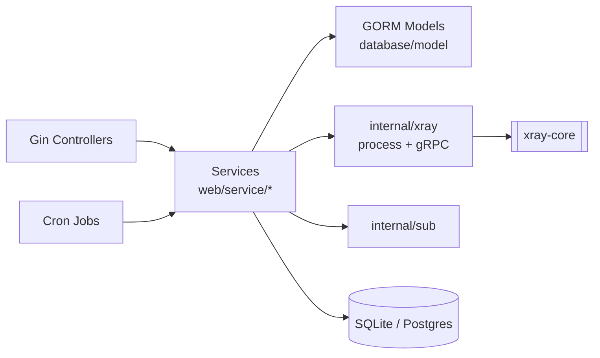

# 05 — Текущая архитектура Go «как есть»

Перед тем как проектировать на Rust, честно фиксируем, **что хорошо** в Go-версии (заимствуем) и
**что плохо** (исправляем). Анализ — по shallow-клону `v3.3.1`.

## 5.1. Фактическая структура

```
3x-ui/ (Go 1.26, module v3)
├── main.go                  # CLI + bootstrap (runWebServer, миграции, сигналы)
├── internal/
│   ├── config/              # env-конфиг (XUI_*), version, name
│   ├── database/            # GORM: SQLite (WAL) + Postgres, AutoMigrate, сидеры, миграция данных
│   │   └── model/           # 18 GORM-моделей (Inbound, ClientRecord, Node, Setting, ...)
│   ├── eventbus/            # in-process pub/sub + rate-limiter
│   ├── logger/              # dual backend (console/syslog + file rotation) + ring-buffer
│   ├── mtproto/             # менеджер sidecar-процессов mtg (Telegram MTProto)
│   ├── sub/                 # подписки: raw / clash / json, external links, fallback-проекция
│   ├── util/                # crypto, ldap, link, netproxy, wireguard, random, ...
│   ├── web/
│   │   ├── controller/      # HTTP-хендлеры (inbound, client, node, server, setting, api, ws)
│   │   ├── service/         # ВСЯ бизнес-логика (client*, inbound*, node*, xray*, setting*, tgbot, ...)
│   │   ├── entity/          # DTO (AllSetting, Msg)
│   │   ├── job/             # cron-джобы (traffic, ip-limit, node-sync, reset, ldap, stats)
│   │   ├── session/         # сессии/auth
│   │   ├── middleware/      # security headers, CSRF, body-limit, validate
│   │   ├── runtime/         # абстракция local-Xray vs remote-node
│   │   ├── websocket/       # хаб real-time обновлений
│   │   └── locale/          # i18n (13 языков)
│   └── xray/                # процесс Xray, config, gRPC API, hot-diff, traffic
├── frontend/                # React 19 + Ant Design 6 + Vite 8 + TanStack Query + Zod
└── tools/openapigen/        # генератор OpenAPI/Zod-типов из Go (single source of truth)
```

**Стек:** Go 1.26, Gin (HTTP), GORM (ORM), gRPC (к Xray-core), robfig/cron, telego (Telegram),
go-i18n, fasthttp. Фронтенд — отдельное SPA, типы API кодогенерируются из Go в Zod/OpenAPI.

## 5.2. Слои (как они есть)



Фактически это «толстый сервисный слой»: контроллеры тонкие, **вся логика в `web/service/`**
(~40 файлов), модели = GORM-структуры с запросами, домена как отдельного слоя нет.

**Те же слои в ASCII** (видно «толстый сервисный слой» — вся логика в одном месте):

```
   ┌──────────────┐     ┌───────────────────┐
   │ Cron Jobs    │────▶│                   │        ┌────────────────────┐
   │ web/job/*    │     │   SERVICES        │───────▶│ GORM Models        │
   └──────────────┘     │   web/service/*   │        │ database/model     │
   ┌──────────────┐     │   (~40 файлов —   │        └─────────┬──────────┘
   │ Gin          │────▶│    ВСЯ логика)    │                  ▼
   │ Controllers  │     │                   │        ┌─────────────────────┐
   └──────────────┘     │                   │───────▶│ SQLite(WAL)/Postgres│
   ┌──────────────┐     │                   │        └─────────────────────┘
   │ WebSocket Hub│◀───▶│                   │
   └──────────────┘     └───┬───────────┬───┘
                            │           │
                            ▼           ▼
                  ┌──────────────┐  ┌──────────────┐    ┌───────────┐
                  │ internal/xray│  │ internal/sub │    │ xray-core │
                  │ proc + gRPC  │──┼──────────────┼───▶│(DataPlane)│
                  │ + hot-diff   │  │ links/clash  │    └───────────┘
                  └──────────────┘  └──────────────┘
   ▲ домена как отдельного слоя НЕТ: правила перемешаны с GORM-запросами и gRPC ▲
```

## 5.3. Что хорошо (заимствуем в Rust)

1. ✅ **Чистое отделение control-plane от data-plane.** Панель оркестрирует Xray, не проксирует сама.
   Это правильная граница — сохраняем.
2. ✅ **Hot-diff.** Семантическое сравнение конфигов и применение через gRPC без рестарта — отличная
   идея, ядро ценности. Переносим как доменный сервис ([04](04-domain-model.md#hot-diff)).
3. ✅ **`Client` как самостоятельная сущность** с many-to-many к инбаундам (`ClientInbound`).
   Один клиент → много инбаундов, одна подписка по `subId`. Правильное агрегирование.
4. ✅ **Event bus + rate-limiter** для развязки уведомлений. Гасит «дребезг» статусов.
5. ✅ **Property-based тесты** (`pgregory.net/rapid`) — для трафика/подписок/hot-diff. На Rust
   эквивалент — `proptest`/`quickcheck`. Обязательно переносим философию.
6. ✅ **OpenAPI/Zod-кодоген как single source of truth** между бэком и фронтом. На Rust —
   `utoipa`/`aide` + генерация TS-типов. Сохраняем подход «контракт из кода».
7. ✅ **SQLite по умолчанию (WAL), Postgres опционально.** Низкий порог входа + масштабирование.
8. ✅ **Runtime-абстракция local vs remote** (`web/runtime`) — это уже зачаток порта. На Rust
   станет честным trait'ом.
9. ✅ **Идемпотентные сидеры с историей** (`HistoryOfSeeders`) — аккуратные миграции данных.

## 5.4. Что болит (исправляем в Rust)

1. ❌ **Нет доменного слоя.** Бизнес-правила (лимиты, отключения, сброс) размазаны по сервисам и
   джобам, перемешаны с GORM-запросами и gRPC-вызовами. Тяжело тестировать в изоляции.
   → На Rust: чистый синхронный домен, отдельный от I/O.
2. ❌ **GORM повсюду, нет репозиториев.** Модели сами делают запросы; домен «знает» про БД.
   → На Rust: trait-репозитории, домен не зависит от persistence.
3. ❌ **`SettingService` читается отовсюду как глобальное состояние** (без DI). Скрытая связность.
   → На Rust: снимок `Settings` передаётся явно в сценарий.
4. ❌ **Строки и `map[string]any` вместо типов.** Протоколы, стратегии, креденшелы — строки/мапы,
   проверяются в рантайме. → На Rust: `enum`/newtype, проверки на этапе компиляции.
5. ❌ **Конфиг Xray (JSON) протекает в сервисы.** Нет чёткого ACL вокруг формата Xray.
   → На Rust: BC-2 за портом `XrayController`, домен не видит сырого JSON.
6. ❌ **«Толстый сервис» как свалка.** `web/service/` — 40 файлов разной ответственности в одной куче.
   → На Rust: разрезать по ограниченным контекстам (workspace-crate'ы).

## 5.5. Главный архитектурный урок

Go-версия **функционально богатая и зрелая**, но построена в стиле «service layer + active record».
Это работает, но цена — слабая тестируемость ядра и высокая связность. **Перенос на Rust имеет смысл
только если мы не копируем эту структуру, а извлекаем из неё чистую доменную модель** (документы
[02](02-ubiquitous-language.md)–[04](04-domain-model.md)) и строим вокруг неё гексагональную
архитектуру — см. [06-rust-redesign.md](../06-rust-redesign.md).
