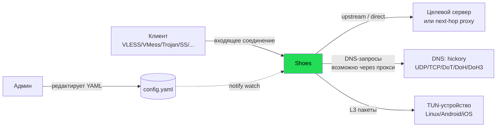

# 01 — Системный контекст и назначение

## 1.1. Что делает shoes

shoes — **data-plane**: программа, через которую физически идёт трафик. В отличие от 3x-ui (control-plane,
который только конфигурирует чужое ядро), shoes сам терминирует протоколы, расшифровывает, маршрутизирует
и пересылает байты. Управляющего API у него нет — конфигурация задаётся файлом и применяется hot-reload'ом.

## 1.2. Акторы и внешние системы



| Актор / система | Взаимодействие |
|-----------------|----------------|
| **Клиент прокси** | Открывает входящее соединение по одному из протоколов; проходит handshake/auth |
| **Админ** | Редактирует YAML-конфиг; изменение подхватывается через `notify` (file watch) |
| **Upstream / next-hop** | Конечный сервер или следующий прокси в цепочке (multi-hop) |
| **DNS-резолверы** | Резолвинг имён; может идти через ту же прокси-цепочку (`ProxyRuntimeProvider`) |
| **TUN-устройство** | В VPN-режиме — приём L3-пакетов, терминация через userspace-стек (smoltcp) |

**Та же диаграмма в ASCII:**

```
 ┌──────────┐ входящее соед.   ╔════════════════════════════╗ upstream/direct  ┌──────────┐
 │  Клиент  │──(VLESS/VMess/──▶║          shoes             ║──(multi-hop)────▶│ Upstream │
 │  прокси  │   Trojan/SS/...) ║       DATA  PLANE          ║                  │ / next   │
 └──────────┘                  ║                            ║                  └──────────┘
 ┌──────────┐ правит YAML      ║  accept → handshake →      ║ DNS (возможно     ┌──────────┐
 │  Админ   │──(notify watch)─▶║  judge → chain →           ║──через прокси)───▶│ hickory  │
 └──────────┘                  ║  copy_bidirectional        ║                  │ DoT/DoH/.│
 ┌──────────┐ L3-пакеты        ║                            ║                  └──────────┘
 │   TUN    │══(smoltcp)══════▶║                            ║
 │устройство│                  ╚════════════════════════════╝
 └──────────┘   ▲ управляющего API / БД / панели НЕТ — конфиг = единственный источник истины
```

## 1.3. Границы системы

**Внутри shoes:** приём соединений, протокольные handshakes, транспортная криптография (TLS/REALITY/
Vision/ShadowTLS/QUIC), правила маршрутизации, цепочки прокси с балансировкой, DNS, userspace TCP/IP-стек
для TUN, побайтовая пересылка.

**Снаружи (НЕ в shoes):**
- ❌ Управляющий API / панель / БД пользователей.
- ❌ Учёт трафика per-user, биллинг, лимиты по объёму/сроку (есть только per-connection idle-tracking).
- ❌ Подписки, Web-UI, Telegram.
- ❌ Хранение состояния между перезапусками (конфиг — единственный источник истины).

## 1.4. Назначение для нашего проекта

- **Как кандидат на data-plane (путь B):** shoes покрывает ровно нужный набор протоколов и транспортов
  (включая REALITY/Vision) на чистом Rust под MIT. Главный пробел — отсутствие management-API: чтобы
  использовать как движок панели, пришлось бы добавить контроль (hot add/remove user, статистику).
- **Как источник идей (путь A):** типизированная модель конфига, декоратор-транспорты, trait-абстракции,
  hot-reload — переносимы в нашу панель на уровне паттернов (см. [06](06-patterns-and-takeaways.md)).

## 1.5. Контраст с 3x-ui

| | 3x-ui | shoes |
|--|-------|-------|
| Слой | control-plane (панель) | data-plane (ядро) |
| Трафик идёт через него? | нет (через xray) | да |
| Конфиг | БД (GORM) + JSON для xray | декларативный YAML |
| Управляющий API | да (Web + Telegram) | нет |
| Учёт трафика | per-user, durable | per-connection idle only |
| Язык | Go | Rust |

→ shoes и 3x-ui **дополняют** друг друга: один — движок, другой — управление. Путь B = «панель на Rust
+ shoes как движок» потребовал бы срастить их через дописанный управляющий слой.
