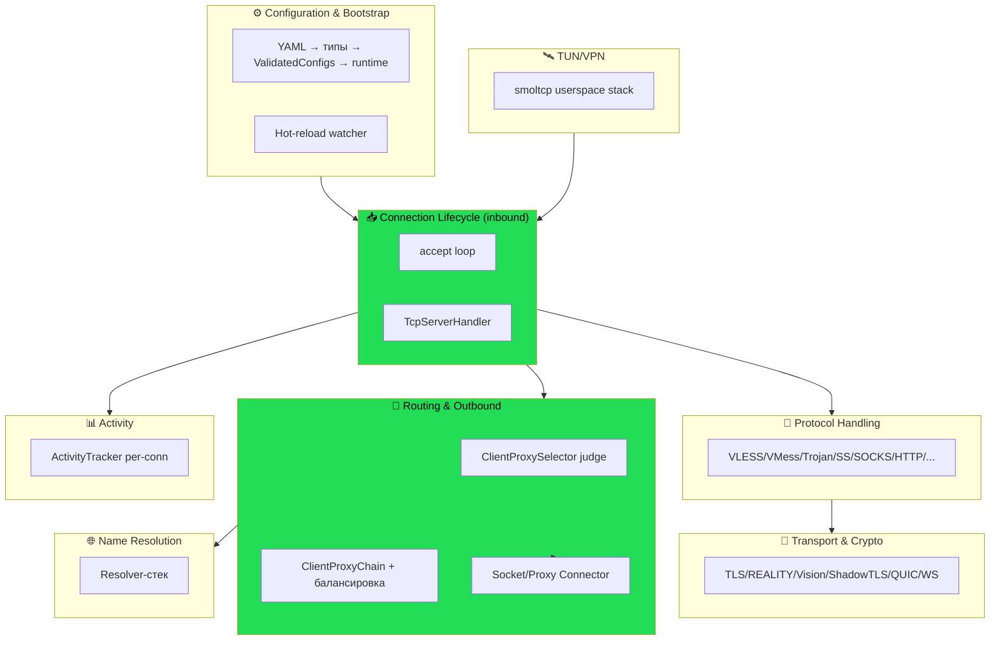

# 03 — Ограниченные контексты

shoes — единый бинарь, но внутри ясно вычленяются связные подобласти. Разложим их как bounded contexts
(хотя в коде это модули, а не сервисы).

## 3.1. Карта контекстов



Зелёным — **ядро домена** (жизненный цикл соединения + маршрутизация). Остальное — поддерживающие
контексты.

**Та же карта в ASCII** (все связи — через trait-порты; ★ — ядро домена):

```
   ⚙️ Configuration & Bootstrap   (YAML → типы → validate → runtime; hot-reload watcher)
              │ собирает граф trait-объектов и запускает
              ▼
   ┌──────────────────────────────────────────────────────────────────┐
   │ ★ 📥 Connection Lifecycle  (accept loop, задача на соединение)      │
   └───┬───────────────────┬──────────────────────────────┬────────────┘
       │ trait              │ judge()                       │ декоратор
       ▼ TcpServerHandler   ▼                               ▼
   ┌──────────────┐   ┌──────────────────┐        ┌──────────────────────┐
   │ 🧩 Protocol  │   │ ★ 🧭 Routing &   │        │ 🔐 Transport & Crypto │
   │  Handling    │   │   Outbound        │        │ TLS/REALITY/Vision/   │
   │ vless/vmess/ │   │ selector → chain →│        │ ShadowTLS/QUIC/WS      │
   │ trojan/ss/.. │   │ connector         │        │ (обёртки AsyncStream)  │
   └──────────────┘   └────┬─────────┬────┘        └──────────────────────┘
                           │ trait    │ trait
                           ▼ Resolver ▼ Socket/ProxyConnector
                     ┌──────────┐  ┌──────────┐            ┌──────────────┐
                     │ 🌐 Name  │  │ outbound │            │ 📊 Activity  │ per-conn
                     │ Resolution│  │ connect  │            │  (idle only) │ idle-таймаут
                     └──────────┘  └──────────┘            └──────────────┘

   🛰 TUN/VPN: smoltcp userspace stack ──(L3 → L4)──▶ вливается в Connection Lifecycle
```

## 3.2. Контексты

### ⚙️ Configuration & Bootstrap
**Ответственность:** прочитать YAML → распарсить в типы (serde) → провалидировать и развернуть группы/
ссылки → собрать runtime-объекты (резолверы, handler'ы) → запустить серверы → следить за файлом и
перезапускать.
**Ключевое:** многофазная валидация (`create_server_configs`): сбор групп → топологическое разрешение
клиентских групп (Kahn, детект циклов) → разворачивание DNS-групп → валидация серверов. Hot-reload —
**атомарный**: при изменении файла все серверные задачи `abort()`, пауза 3с, полный перезапуск.
**Файлы:** `config/mod.rs`, `config/validate.rs`, `config/types/*`, `main.rs:316`, `builder.rs`, `chain_builder.rs`.

### 📥 Connection Lifecycle (inbound)
**Ответственность:** accept TCP-соединения, по задаче на соединение, прогон входящего handshake с
60-сек таймаутом, диспетчеризация результата (`TcpServerSetupResult`), запуск `copy_bidirectional`.
**Файлы:** `tcp/tcp_server.rs`, `tcp/tcp_conn.rs`, `copy_bidirectional.rs`.

### 🧩 Protocol Handling
**Ответственность:** реализации `TcpServerHandler`/`TcpClientHandler` для каждого протокола; парсинг
кадров, проверка credential, извлечение адреса назначения, fallback. Диспетчеризация через фабрики.
**Файлы:** `vless/*`, `vmess_handler.rs`, `trojan_handler.rs`, `shadowsocks_tcp_handler.rs`,
`socks_handler.rs`, `http_handler.rs`, `mixed_handler.rs`, `snell_handler.rs`, `anytls_*`,
`hysteria2_server.rs`, `tuic_server.rs`, `naiveproxy/*`.

### 🔐 Transport & Crypto
**Ответственность:** обернуть поток транспортом. TLS-терминация (rustls/aws-lc-rs), REALITY (анти-probing
с зеркалированием dest), Vision (XTLS-падинг), ShadowTLS, WebSocket-апгрейд, QUIC-эндпоинты. Унификация
через `CryptoConnection`/`CryptoTlsStream`. Маршрутизация по SNI.
**Файлы:** `tls_server_handler.rs`, `tls_client_handler.rs`, `rustls_config_util.rs`, `reality/*`,
`vless/vision_*`, `shadow_tls_*`, `websocket/*`, `quic_server.rs`, `crypto/*`.

### 🧭 Routing & Outbound
**Ответственность:** по адресу назначения вынести решение (`judge`): allow + цепочка или block; выбрать
цепочку, пройти хопы (round-robin per-hop), установить upstream-соединение. Разделение
`SocketConnector` (создать сокет, хоп 0) и `ProxyConnector` (обернуть протоколом, любой хоп).
**Файлы:** `client_proxy_selector.rs`, `client_proxy_chain.rs`, `proxy_connector*.rs`,
`socket_connector*.rs`, `rules.rs`, `groups.rs`, `selection.rs`, `routing/udp_router.rs`.

### 🌐 Name Resolution
**Ответственность:** резолвинг имён через композируемый стек резолверов (Native/Caching/Composite/
Hickory/Timeout/Refreshing). Ленивый резолв с кэшем в `ResolvedLocation`. DNS может ходить через прокси.
**Файлы:** `resolver.rs`, `dns/composite_resolver.rs`, `dns/hickory_resolver.rs`, `dns/builder.rs`, `address.rs`.

### 📊 Activity (анемичный)
**Ответственность:** per-connection трекинг последней активности для idle-таймаутов и ping-keepalive.
**Важно:** **нет** агрегированного per-user учёта, нет durable-статистики. Это не «Traffic context» как в
панели — только защитный idle-detection.
**Файлы:** `h2mux/activity_tracker.rs`, `h2mux/activity_tracked_stream.rs`.

### 🛰 TUN/VPN
**Ответственность:** в VPN-режиме принять L3-пакеты с TUN-устройства, прогнать через userspace TCP/IP-стек
(smoltcp в отдельном OS-потоке), превратить в L4-соединения и отдать в общий inbound-путь.
**Файлы:** `tun/mod.rs`, `tun/tcp_stack_direct.rs`, `tun/tcp_conn.rs`, `tun/udp_manager.rs`.

## 3.3. Связи между конт配екстами (отношения)

| Источник → Приёмник | Тип связи |
|---------------------|-----------|
| Bootstrap → все | **Конформист**: все контексты потребляют типы конфига как есть |
| Inbound → Protocol | через trait `TcpServerHandler` (порт) |
| Protocol → Transport | декоратор: handler читает из обёрнутого `AsyncStream` |
| Inbound → Routing | `proxy_selector.judge()` (порт) |
| Routing → DNS | через trait `Resolver` (порт), ленивый резолв |
| Routing → Outbound connectors | trait `SocketConnector`/`ProxyConnector` (порты) |
| TUN → Inbound | адаптер: L3 → синтетический `AsyncStream` |

**Наблюдение:** все межконтекстные связи — через **trait'ы (порты)**, а конкретику подставляют фабрики
из конфига. Это та же гексагональная идея, что у нас в [`../06-rust-redesign.md`](../06-rust-redesign.md),
только внутри одного процесса.
